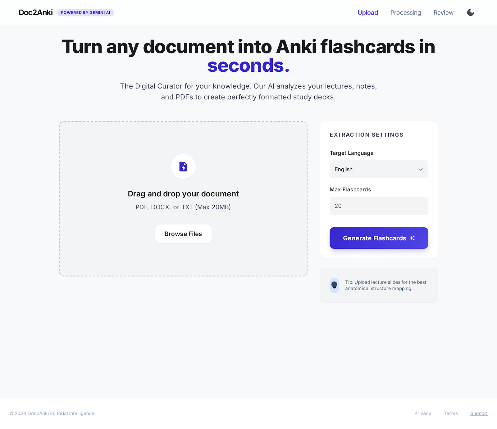

# 🚀 Doc2Anki: AI-Powered Flashcard Generator



**Doc2Anki** is a modern web application that transforms any document (Text, Images, Audio, Video) into professional Anki study decks (.apkg) in seconds, powered by the latest **Google Gemini (Gemma-4-31b-it)** AI.

---

## ✨ Key Features

- **🎨 Premium Design**: Sleek, modern interface with Glassmorphism effects and native Dark/Light mode support.
- **🖼️ Multimodal Support**: Beyond just text! Upload PDFs, Images (JPG/PNG), Audio (MP3/WAV), or even Video (MP4) for direct AI analysis.
- **🧠 Smart AI Engine**: Utilizes `gemma-4-31b-it` to extract core concepts with high precision.
- **🛠️ Flexible Customization**:
    - **Target Language**: Supports Vietnamese, English, Spanish, German, and French.
    - **Card Styles**: Choose between **Standard Key Concepts**, **Multiple Choice (MCQs)**, or **True/False Questions**.
    - **Auto Mode**: AI automatically determines the optimal number of cards based on content length.
    - **Custom Instructions**: Provide specific rules for the AI to follow during extraction.
- **🔒 Privacy First**: Your files are uploaded via a secure API and are **automatically deleted immediately** after the processing is complete.

---

## 🛠️ Tech Stack

- **Frontend**: React.js, Vite, Tailwind CSS, Material Symbols.
- **Backend**: FastAPI (Python), Uvicorn.
- **AI Engine**: Google GenAI SDK (Gemini File API & Multimodal Processing).
- **Format**: `.apkg` (Anki Export).

---

## 📖 Getting Started

### 1. Environment Setup

#### Backend
```bash
cd backend
python -m venv venv
source venv/bin/activate  # Linux/Mac
pip install -r requirements.txt
export GEMINI_API_KEY="YOUR_API_KEY_HERE"
uvicorn main:app --reload
```

#### Frontend
```bash
cd frontend
npm install
npm run dev
```

### 2. Workflow

1. **Upload**: Drag and drop or browse for a file (Up to 100MB).
2. **Configure**: Select language, card style, and optional custom instructions.
3. **Generate**: AI analyzes the multimodal content and returns a list of candidate cards.
4. **Review**: Edit the front or back of the generated cards directly in the browser.
5. **Export**: Click "Export to Anki" to download your `.apkg` file.

---

## 📂 Project Structure

```text
├── backend/            # FastAPI Server & Gemini AI Service
├── frontend/           # React App (Vite)
├── design/             # UI/UX Assets & Screenshots
├── AGENT.md            # Coding Standards & Rules
└── docker-compose.yml  # Docker Deployment configuration
```

---

## 📄 License

This project was developed for educational purposes and personal study optimization.
*Powered by Gemini AI* 🌟
